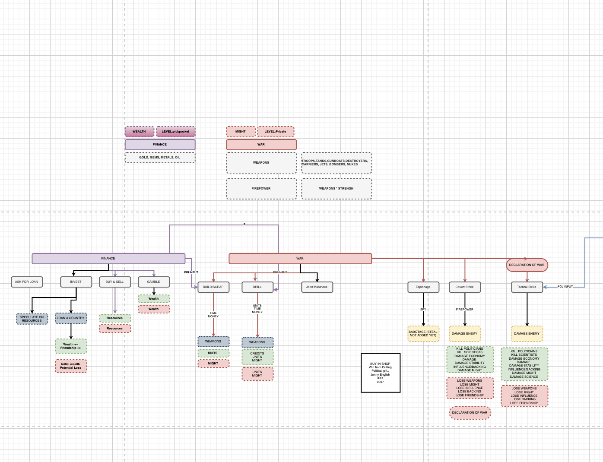
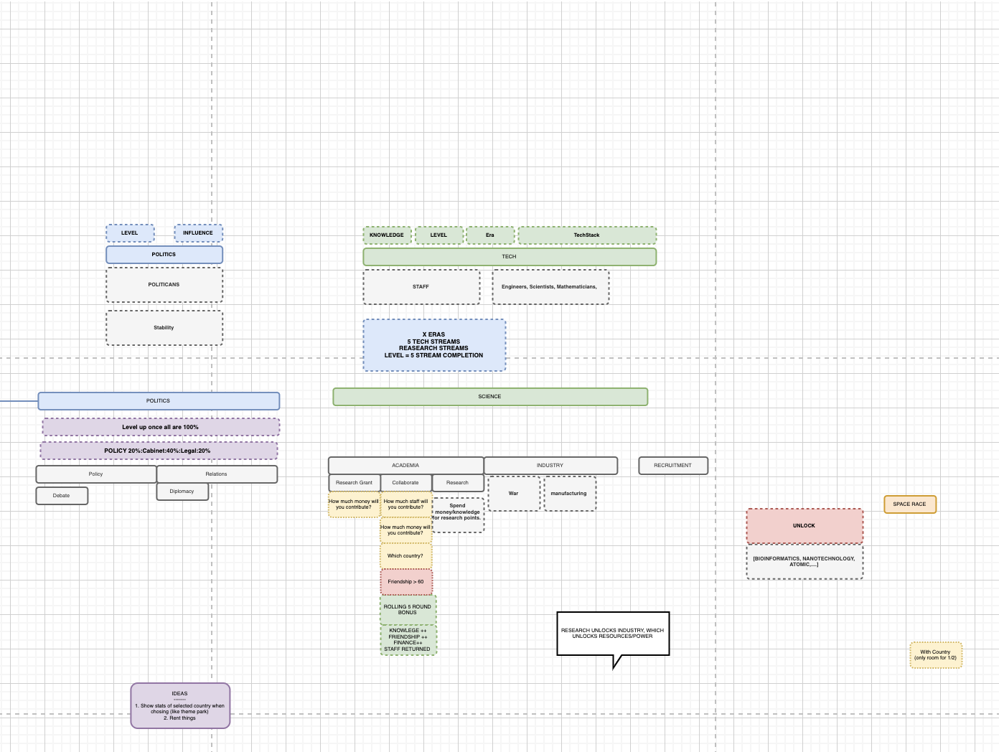
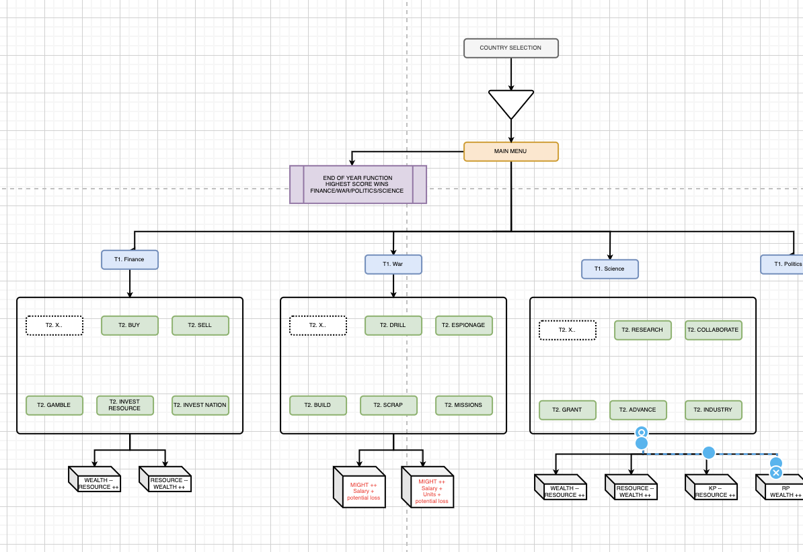
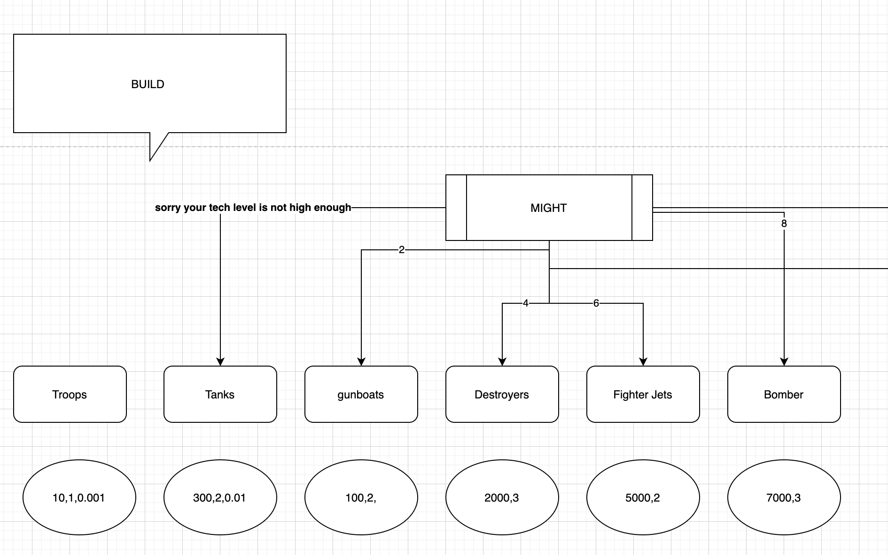

# UNIVERSE 734!

  

# INSTRUCTIONS 

JUST RUN THIS COMMAND TO START 
  
`python universe734.py` 
  
**OR**  

- Mac Users: double click `START.command`
  
  

If you have any issues please contact me `@murchie85@gmail.com`. 

# REQUIREMENTS 

- Python3
  
*if it isn't your default, just run `python3 game.py`* 

# SUMMARY 
  
1. A playable strategy game where you take control of a nation and lead them to glory.
2. Currently a terminal/command prompt game for users that will be ported to Flask web game. 
3. There are multiple ways to grow, Finance, Tech,War and Politics, each with varying options from trading stocks to covert military operations. 
4. The game has multiple measures of success, the main score is a composit of wealth, resources owned, military might, political influence, scientific achievement and development era and more. 
5. you can partake in friendly collaborative projects with allied nations or engage in espionage and aggressive tactics on nations. 
  
  
This game is in development with many features yet to be complete; but this repo will act as a living breathing document.  
## START DATE 15TH OF JUNE   

# ARCHITECTURE AND FLOW  (IN PROGRESS)  

- One entry point
- One main menu
- Four main pillars (War,Tech,Finance,Politics)
- Multiple tiers 
- Multiple menus

  

- Actions have positive and negative impacts
- Actions are submitted into a queue, all countries actions are carried out at the end of the round.  

  
   
- Each Tier can result in advantages for another tier
- For example, researching technology increases options for weapons to build.  
  

  
- Weapons and resources like gold, gems etc have a scale 
- This can include, price, power, wait time for completion and xrp gained.  
  

	    

